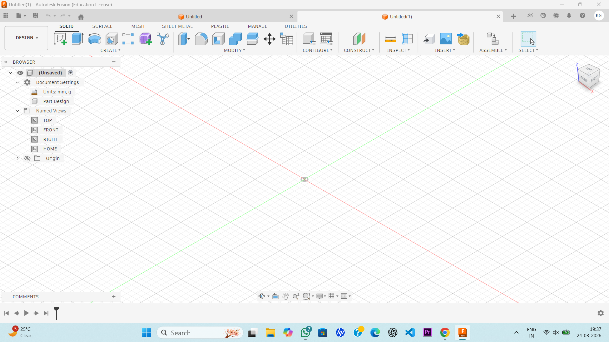

**JOURNAL ENTRY  -- HAND GESTURE ROBOT**
__________________________________________________________________________________________________________________

My project name is HAND GESTURE ROBOT.
THIS  is my first hardware project. I am feeling like writing a diary while writing this journal. 
As I start working on my  PROJECT ,firstly i came to write Journal and after finishing , again i come to this . It's a good experience to write about our 
project with the whole explanation.So that reader can be understand it easily.

__________________________________________________________________________________________________________________

**DAY 1:**                                                                                       
__________________________________________________________________________________________________________________
I THOUGHT ABOUT HOW my working model looks like in 3D . THen i came up with an idea of designing it's rough sktch.
Then I need to work on CAD models , so , I  learn to make CAD MODELS. I InSTALLED THE Required softwares
it took me about 2 to 3 days ,thinking about it.   
IT took approximate   12 hrs to learning CAD by practising again and again in these 2 to 3 days.

__________________________________________________________________________________________________________________

**DAY 2:**                                                                                                 
___________________________________________________________________________________________________________________
So i learn a basic idea about CAD Designing , . AND TODAY I have to design my trsnmitter part of my project,
so i starting  make CAD for my transmitter part . then , i have to make CAD for my receiver part. SO , it took 
about 16 hrs to make the cad designs of all the components like sensors, arduino nano...                   
But, at the end , i satisfied after seeing my CAD Design of transmittre part.

__________________________________________________________________________________________________________________

**DAY 3:**                                                                                                        
___________________________________________________________________________________________________________________
Today I had built my Readme.md file.
Generally , I get heaitated about talking on my work, which I had  done,, but this readme.md is such a great thing .
I am able to explaining about my whole project openely 
Also , github is an open source for all the developers,, so it may be very helpful for all of us to unlock new Idea,
and learning more to more. i spent about 5 hours on making readme.md.

"README.MD" AS WELL AS THIS "journal"  WILL BE  Updated as work goes on progress,, day by day.

__________________________________________________________________________________________________________________

**DAY 4:**
___________________________________________________________________________________________________________________
After , working on my CAD designs , I had  now, requirements for the components for this project , to make it real 
working .So , today I sit on my study table and make the bill of my project,So that I will  apply GRANT for them .
and  after receiving  that , I will order them from the suitable websites. and after receiving those parts I will 
start make my projecgt as soon as possible.                               

I resesrched and researched  online , to choose the best and best and budget friendly parts .                         
I spent about 10 to 12 hrs to find the Parts.                                          

__________________________________________________________________________________________________________________

**DAY 5:**
___________________________________________________________________________________________________________________

todaY I come back to my CAD designing PROCESS,. I sit omn my chair by the thought of com[pleting the cad designs.
so I started making and making , working on my cad modekls .i design and designs, sometimes my deisgn not 
accurate ,then i correct them by making some another mistakes .                                          
So, this is very memorable  moment for me to building such a nice CAD Design , . I became very happy after 
seeing a glance of my model . It took me about  4 to 5 days to complete this task.                             
I spent about total 48 to 50  hrs in these days on making these cad designs, but this is very learning journing.                          

_________________________________________________________________________________________________________________________________________________________________________________________________________________________________

 After this i am applying for the grant. i want to work on this project as soon as possible as it is making me very excited.

  

