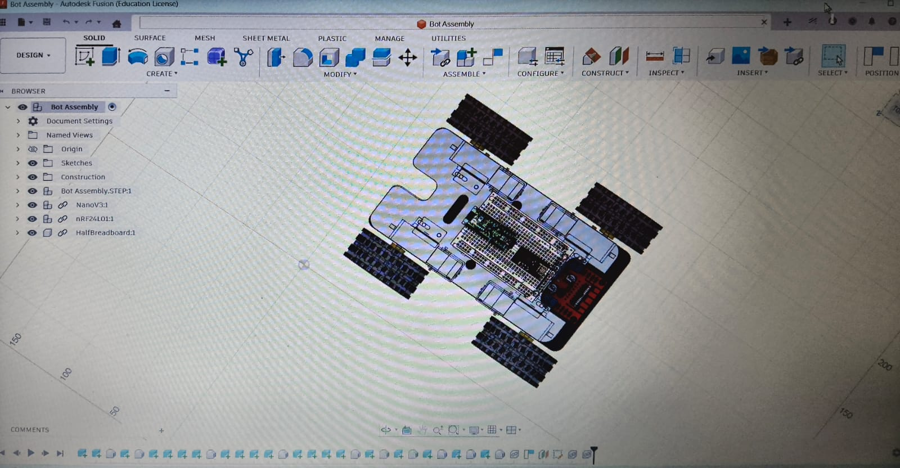
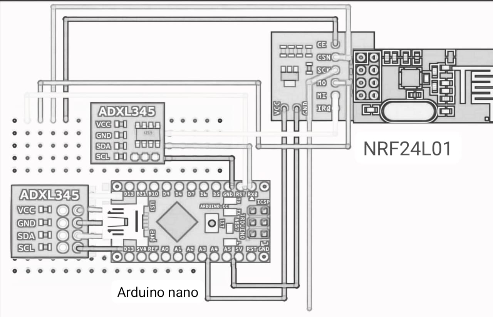
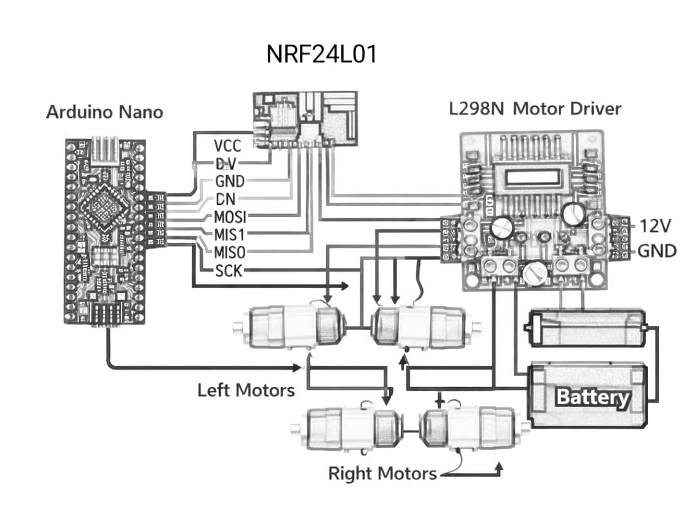
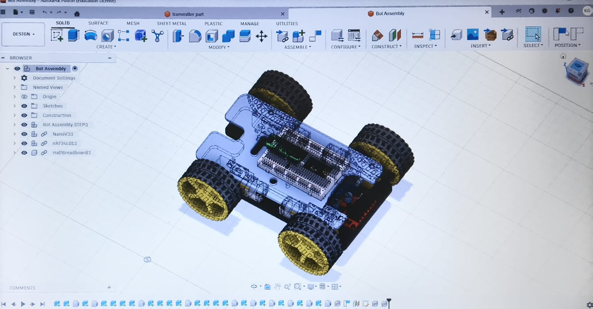
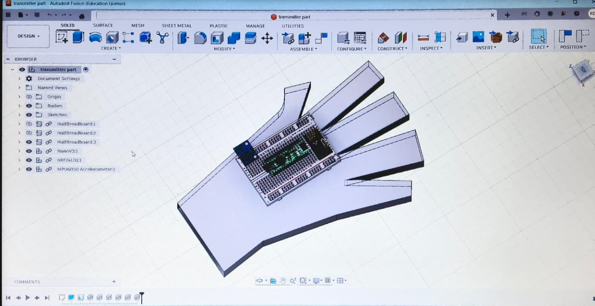

## **HAND GESTURE CONTROLLED BOT**

Traditional robot control methods like wired controllers or joysticks lesses their uses and their interaction with everyone.So, there is a need for wireless,easily handable and human friendly control robots, especially for learning robotics and human–machine interaction.

**SOLUTION ,WHICH HELPS US.**

This project implements a hand gesture controlled robot using an accelerometer and NRF24L01 wireless modules.  Our hand movements are captured by the transmitter unit which is  placed at our hand and sent wirelessly to a receiver unit which is on the robot. The receiver interprets these gestures and controls four DC motors accordingly and enabling us smooth and responsive robot movement.

## HOW THIS WORKS

At first,  Our Hand gestures are detected by using an accelerometer.Then,the transmitter Arduino Nano processes gesture data.Then,Commands are sent wirelessly using the "NRF24L01 module" from transmitter Arduino Nano to receiver Arduino  Nano.
Then,receiver Arduino  decodes the data.and give commands to  receiver Arduino.And by using a motor driver ,we control four motors based on received commands.

## **COMPONENTS WHICH ARE USED IN MAKING THIS PROJECT, ARE LISTED AS SHOWN BELOW:**
1.ARDUIno NANO(2)                                                                         
2. ADXL345 Accelorometer (1)                                                                                             
3. nrf24L01 transeiver module (2)                                    
4. motor DRIVER (1)                                                                                                                    
5. DC Motors (4)                                                                                     
6. jumping wires( as per need)                                                                    
7. BATTERY 12 volt (1)                                                                                            
8. Battery  9 volt (1)                                                                                     
9. Tires (4)                                                                                            
10.Skeleton board for making a car bot(1)                                    
11. breadbord (2)                                                                                        

**## CIRCUIT AND PIN CONNECTIONS**

**[TRANSMITTER SIDE {hand controller}  ]**                                                                        
COMPONENTS:---
1. Arduino Nano
2. ADXL345 Accelerometer                                                                        
3.NRF24L01

[ADXL345 Pin ->  ARDUINO NANO(I2C)]                                                                                                                                                                                                                        
ADXL345 SDA-----A4(ARDUINO)                                                                                                      
ADXL 345 SCL-----A5(ARDUINO)                                                                                                            
ADXL 345 VCC----3.3V                                                                                                     
ADXL 345 GND---GND                                                                                                                                    

[NRF24L01   -> ARDUINO NANO]                                                                                                                                                                                                                        
NRF24L01 SCK----D13                                                                               
NRF24L01  CE---D9                                                                                                 
NRF24L01 CSN---D10                                                      
NRF24L01 MOSI-----D11                                                                      
NRF24L01  MISO----D12                                                                                   
NRF24L01 VCC----3.3V
NRF24L01 GND---GND

IMPORTANT : NRF works only on 3.3 V( NOT 5V)

____________________________________________________________________________________________________________________________________________________________________________________________________________________________

**[RECEIVER SIDE { ON THE ROBOT}  ]**                                                                        

COMPONENTS:--                                                                        
1, Arduino Nano                                               
2. NRF24L01
3. L298N Motor Driver
4, DC MOTOR(*4)

[NRF24L01  ->  Arduino]                                                                                                                                                                                                                                                            
NRF24L01 CE---D9                                                                     
NRF24L01 CSN---D10                                                                
NRF24L01 SCK---D13                                                              
NRF24L01 MOSI---D11                                                                          
NRF24L01 MISO---D12                                            
NRF24L01 VCC---3.3V                                                                                                                                   
NRF24L01 GND---GND                                                                         

[MOTOR DRIVER L298N PIN -->Arduino]                                                                                                            

IN1 ----------D2                                                          
IN2-----------D3                                                
IN3---------D4                                                   
IN4---------D5                                                                                                                                                                                                                                                                                       

-------------------------------------------------------------------------------------------------------------------------------------------------------------------_______________________________________________________________________________________________________________________________________________________
DC MOTORS ------MOTOR DRIVE AS AN OUTPUT...

**POWER SETUPS**                                                                                                                   
TRANSMITTER:                                                                                                                       
Arduino  POWERED VIA 9V BATTTERY.

RECEIVER:                                                                                                            
BATTERY  -> L298N                                                                        
L298N  -> POWER SOURCES                                                                        
Arduino   GETS POWER FROM BATTERY 12 V BATTREY                                                                    

**COMMON MISTAKES**                                      
1,. NO COMMON GROUND WILL LED TO FAILURE OF SYSTEM.                                    
2,. LOOSE WIRES MEANS UNSTABLE ROBOT.                                                                        
3., WEAK  BATTERY LED MOTORS NOT TO MOVE PROPERLY.                                    

**CAUTION!!!!!**                                                    
WE have to make sure that NRF24L01 is powered by the 3.3v ,,not by the 5V ,,to avoid any damage to any electronic items ,which are used or any communication failure in making the project.                                    

## **WORKING PRINCIPAL**                                                                        
 

1. AT FIRST ,, AS WE  SHOULD MAKE ALL THE CONNECTIONS PROPERLY AND CONNET THE BATTERY TO THE WIRES TO MAKE THE CCIRCUIT COMPLETE .                                                                        
2. THEN,AFTER CONNECTING ALL THE CIRCUITS PROPERLY,,THE ACCELEROMETER ,,WHICH IS PLACED ON OUR HAND ,SENSES OUR MOVEMENT , AS OUR HAND CAN TILT IN ALL THE DIRECTIONS ,, THE SENSOR DETECTS THE MOVEMENT OF OUR HAND IN ALL THE DIRECTIONS AS OUR HAND MOVES.                                                          
3.ARDUINO NANO,WHICH IS PLACED ON OUR HAND WITH SIDE OF ADXL, CONVERTS SENSOR VALUES ALL  MOVEMENT COMMANDS INTO THE NUMERICAL VALUES.                                                                                                        

4. ALL THE COMMANDS ARE TRANSMITTED WIRELESSLY USING NRF24L01.                                                             
5. RECEIVER ARDINO NANO DECODES ALL THA RECEIVED DATA COMMANDS AND TAKE ACTION ON THE RECEIVED SIGNAL WIDTH THE HELP OF MOTOR DRIVER AND ALL THE 4 MOTORS.                                                        

6.THEN, OUR MOTOR DRIVER ACTIVATES ALL THE 4 MOTORS TO MOVE THE ROBOT IN FORWARD,BACKWARD,LEFT OR RIGHT DIRECTIONS AS PER THE RECEIVED COMMANDS BY THE  RECEIVER ARDUINO NANO.                             

7.IN THIS WAY ,, FINALLY ,, OUR HAND GESTURE ROBOT IS READY TO  WORK.                           

 ## **CODE EXPLANATION**                                                                                                      

[TRANSMITTER SIDE]                                                                                     
IT READS THE ADXL VALUES.                                                                                                 
THEN, SENSES,DETECT AND CALCULATE OUR HAND OREINTATION VALUES TO THE DIRCECTION  COMMANDS.                
THEN, ALL THE COMMANDS ARE SENT BY THE USE OF NRF24L01 WIRELESSELY.                                                  

[RECEIVER  SIDE]                                                                           
                                                                        
IT READS ALL THE INCOMING DATA .                                                                 
AND THEN IT MATCHES ALL THE RECeIVED COMMANDS TO THE PREDEFINED DATA MOVEMENTS.                         
AND THEN  CONTROLS MOTOR DRIVER PINS ACCORDINGLY TO THE RECEIVED COMMANDS AND MOVE THE BOT AVCCORDING TO THAT SIGNALS.                                                                                                  

 ## **PROJECT FILES**                                                                        
'gesture_transmitter.ino  -> transmitter code (hand side)                                     
'gesture_receiver.ino  ->receiver code (robot's side)                                 

## **COMMUNICATION MODE**                                                                        
A Wireless communication is done using a NRF25L01 (2.4 Ghz).                                                                                
Data transmitted : by using the X and Y values of our hand directions.                                    

## **3D CAD DESIGN'S SCREENSHOTT**

______________________________________________________________________________________________________________

__________________________________________________________________________________________________________________

______________________________________________________________________________________________________________
## **HOW TO RUN OUR ROBOT**                                                        
(step by step  rules )                                                                        
1.first upload,'gesture_transmitter.ino'  to the transmitter **ARDUINO NAno**.                                    
2. Then upload 'gesture_receiver.ino' to the receiver **ARduiNO Nano**.                             
3.Then, connect all the mentioned components as shown in the image properly.
4.Make sure all the connections should be proper to avoid any damage of any components and also to run our hand controller properly.                                                                             
5.  Now, give  power   to both the circuits.
6. BATTEry should be charged to  run the bot proprly.                                  
7. NOW, Tilt your hand to control the motion of the robot.                                        
8. And , finally , you will see our hand controller is moving.                                     
9. Hence, in this way, our project is successfull.                                                                                                                                                                              

# BOM    

|FIELD1                               |Description                            |Quantity|Unit Price($)|Total Price($)|URL                                                                                                                                                                                                                                                                      |
|-------------------------------------|---------------------------------------|--------|-------------|--------------|-------------------------------------------------------------------------------------------------------------------------------------------------------------------------------------------------------------------------------------------------------------------------|
|Lithium ion Rechargeable Battery Pack|To provide voltage  at receiver Side   |1       |18.12        |18.12         |https://amzn.in/d/02r57axJ                                                                                                                                                                                                                                               |
|9V DC                                |To supply power at transmitter side    |1       |3.23         |3.23          |https://amzn.in/d/6o6k6E5                                                                                                                                                                                                                                                |
|ADXL345                              |Identify   hand gesture and orientation|1       |69           |69            |https://amzn.in/d/5sbo3Or                                                                                                                                                                                                                                                |
|Arduino Nano                         |Brain of the system                    |2       |20.43        |40.86         |https://amzn.in/d/a4FrkHo                                                                                                                                                                                                                                                |
|NRF24L01+                            |Use for wireless Communication         |2       |2.77         |5.55          |https://amzn.in/d/aO1o65D                                                                                                                                                                                                                                                |
|Material Kit                         |For making  robot                      |1       |73.86        |73.86         |https://www.amazon.in/dp/B0FSCWHC97?ref_=cm_sw_r_cso_cp_apan_dp_3Z9D9ZPHTN44HPA36XH1                                                                                                                                                                                     |
|Motor Driver                         |To Control Motors                      |1       |1            |5.44          |https://www.flipkart.com/ibat-solutions-l-298-n-power-driver-ic-l298n-motor-electronic-components-hobby-kit/p/itm64a01ede4c553?pid=EHKGUZSTFWKPZHQT&lid=LSTEHKGUZSTFWKPZHQTHN7PJO&marketplace=FLIPKART&hl_lid=&q=motor+driver+l298n&store=tng%2F8k8&pageUID=1766301522635|
|Breadboard                           |For suitable Connection                |2       |3.19         |6.38          |https://amzn.in/d/0c2ImEzs                                                                                                                                                                                                                                               |
|Jumper Wires                         |To connect different Parts             |2       |3.4          |6.8           |https://amzn.in/d/0cu2anFK                                                                                                                                                                                                                                               |
|Hand Glove                           |To hold transmitter side components    |1       |4.25         |4.25          |https://amzn.in/d/08CEedM8                                                                                                                                                                                                                                               |
|Double Sided Tape                    |To attach components                   |1       |0            |0             |Already Own                                                                                                                                                                                                                                                              |
|                                     |                                       |        |             |              |                                                                                                                                                                                                                                                                         |
|TOTAL                                |                                       |        |             |240.29        |                                                                                                                                                                                                                                                                         |

                                              

**FUTURE IMPROVEMENTS**                                                                                               
1.Adding of  obstacle avoiding appliance.                                                                                      
2. Improve gesture accuracy.                                                                                                  
3. ADDING OF THE CAMERA.                                                                                       

**PROJECT BY**                                                                        
KHUSHI GUPTA

